# Connecting Cursor to CAI

Follow these steps each time you want to connect Cursor to your Cloudera AI workbench session. The `connect-cursor-cai.sh` script automates login, session startup, SSH tunneling, and SSH config updates.

!!! info "Before you start"
    Complete all steps in **[Prerequisites](prerequisites.md)** first. You must have `cdswctl`, `jq`, an SSH key pair, an API key, and a CAI project created.

---

## 1. Start Cursor and open a project folder

Launch **Cursor** and open a local folder where you will work (for example, `my-cai-project`). This folder is only used locally to hold the cloned scripts and your environment file.

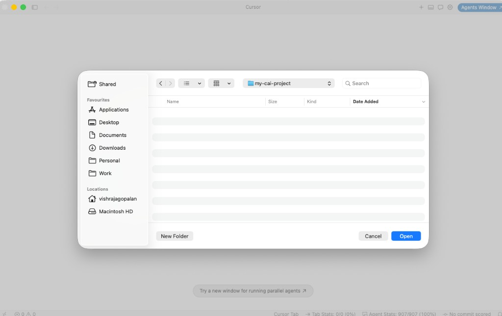

## 2. Clone the connection repository

Open the integrated terminal (**View → Terminal** or **Ctrl+`**`) and clone this repository:

```bash
git clone https://github.com/SuperEllipse/cai-cursor-vibe-coding
cd cai-cursor-vibe-coding
ls
```

You should see `README.md`, `connect-cai.env.example`, and `connect-cursor-cai.sh`.

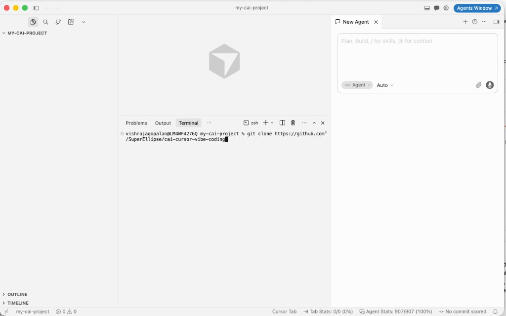

## 3. Create your environment file

Copy the example environment file and open it for editing:

```bash
cp connect-cai.env.example connect-cai.env
vi connect-cai.env
```

You can use any editor (`nano`, `vim`, or Cursor's file explorer).

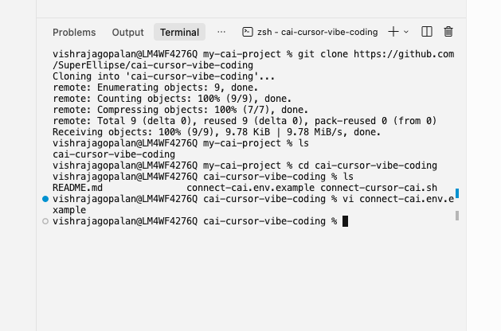

## 4. Update configuration values

Edit `connect-cai.env` and set the **mandatory** values:

| Variable | Description | Example |
|----------|-------------|---------|
| `CAI_DOMAIN` | Cloudera AI workbench URL from your browser | `https://ml-xxxx.cloudera.site` |
| `CAI_USERNAME` | Your Cloudera AI username | `vishrajagopalan` |
| `API_KEY` | API key from **User Settings → Keys & Access → API Keys** | `your-api-key` |
| `PROJECT_NAME` | Full project slug: `<username>/<project-name>` | `vishrajagopalan/vibe-coding-demo` |

!!! warning "PROJECT_NAME must be the full slug"
    Use `<CAI_USERNAME>/<project-name>`, not just the project name. For team projects, use the owner slug from the browser URL (e.g. `team-owner/shared-project`).

Optional overrides (CPU, memory, GPU, Spark) are documented in `connect-cai.env.example`.

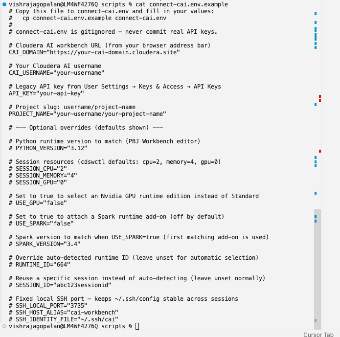

## 5. Run the connection script

Run the script, pointing it at your environment file:

```bash
CONNECT_CAI_ENV=./connect-cai.env ./connect-cursor-cai.sh
```

You can also use a differently named file (for example, `./my.cai.env.demo`):

```bash
CONNECT_CAI_ENV=./my.cai.env.demo ./connect-cursor-cai.sh
```

The script will:

1. Verify prerequisites (`cdswctl`, `jq`, SSH key, API key, project slug)
2. Log in to Cloudera AI
3. Auto-select a **PBJ Workbench** runtime (Python 3.12, Standard edition)
4. Start or reuse a running session
5. Update `~/.ssh/config` and start the SSH tunnel

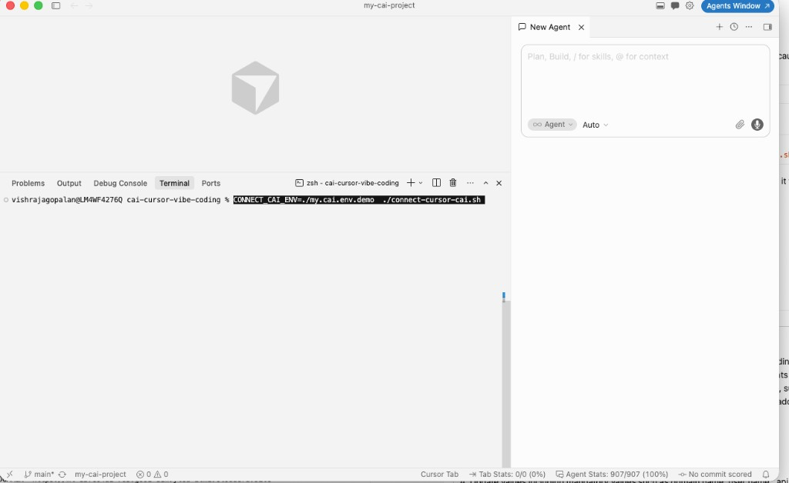

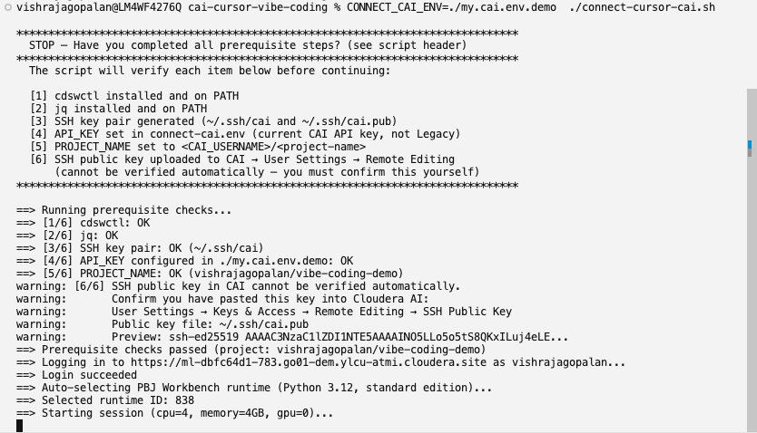

## 6. Verify the session is running remotely

Open your Cloudera AI Workbench in the browser and navigate to **Project → Sessions**. Confirm that a session is **Running**.

!!! note "Session startup may take time"
    Starting a session depends on available cluster resources and quotas. If the session stays in a pending state, check with your administrator or try again later.

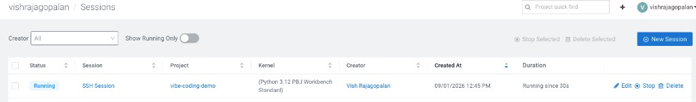

## 7. Confirm the SSH tunnel is active

Return to the terminal where the script is running. You should see output confirming the tunnel is active, along with next-step instructions:

- Local port forwarding (e.g. port `3735` → remote port `2222`)
- **SSH tunnel is active — keep this terminal open**
- Steps to connect in Cursor

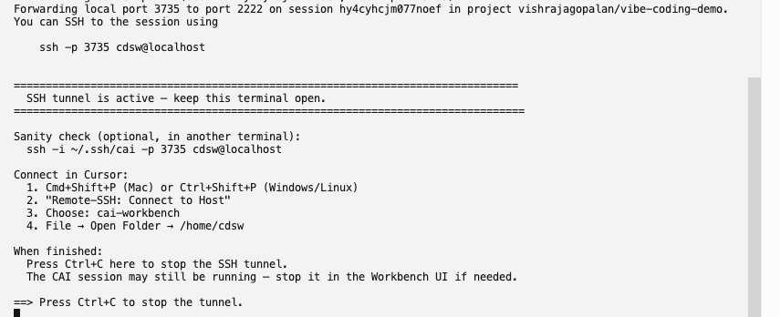

## 8. Verify SSH works (optional sanity check)

Open a **second** terminal (locally, not the tunnel terminal) and test the SSH connection:

```bash
ssh -i ~/.ssh/cai -p 3735 cdsw@localhost
```

A successful connection changes your prompt to something like `cdsw@<session-id>:~$`. Type `exit` to disconnect.

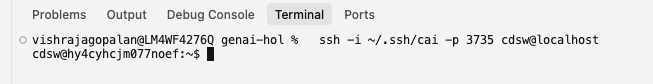

## 9. Connect to the host in Cursor

In Cursor (your **local** window, not the remote one):

1. Press **Cmd+Shift+P** (Mac) or **Ctrl+Shift+P** (Windows/Linux)
2. Select **Remote-SSH: Connect to Host**
3. Choose **`cai-workbench`**

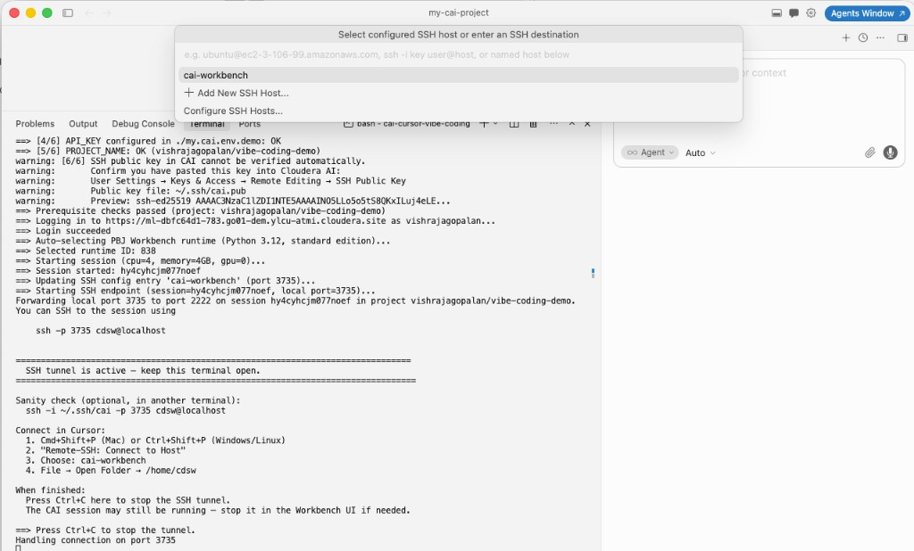

## 10. Open the remote folder

After Cursor connects, open the remote workbench directory:

**File → Open Folder → `/home/cdsw`**

You should see the remote file structure (`.cache`, `.cursor`, `main.py`, etc.) in the sidebar. The window title will show `cdsw [SSH: cai-workbench]` and the status bar will display **SSH: cai-workbench**.

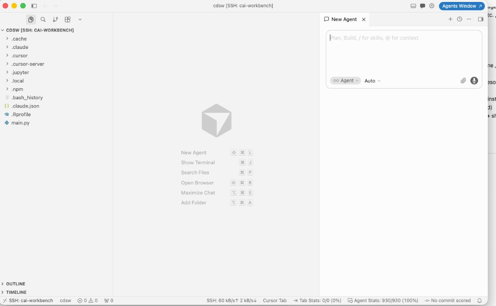

---

## When you are done

- Press **Ctrl+C** in the terminal running the connection script to stop the SSH tunnel.
- The CAI session may still be running — stop it in the Workbench UI under **Sessions** if you want to free resources.

## Troubleshooting

| Issue | What to check |
|-------|---------------|
| Login fails with 401 | Use a current API key (not Legacy). Create a new key under **API Keys**. |
| SSH connection refused | Ensure the tunnel terminal is still open and the script reported success. |
| `PROJECT_NAME` error | Must be full slug: `<username>/<project-name>`. |
| Session won't start | Check cluster quotas and resource availability in the CAI UI. |
| SSH key rejected | Confirm `~/.ssh/cai.pub` is added under **Remote Editing** in CAI user settings. |

For more detail, see the [repository README](https://github.com/SuperEllipse/cai-cursor-vibe-coding) or the [original setup guide](https://superellipse.github.io/zeta-hol/vibe-coding/cursor-remote-ssh/).
