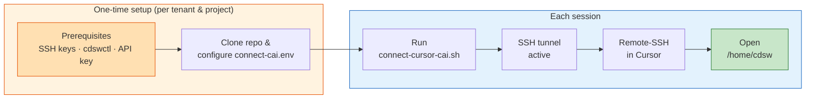

# Cursor + Cloudera AI — Vibe Coding

Connect **Cursor IDE** to your Cloudera AI workbench session using **Remote SSH**, so you can use AI-assisted coding directly against your project environment, data connections, and runtimes.

This guide has two paths:

1. **[Quickstart](quickstart.md)** — minimal checklist: clone, configure, run the script, connect.
2. **[Step by Step Setup](prerequisites.md)** — detailed guides with screenshots:
    - **[Prerequisites](prerequisites.md)** — one-time setup: SSH keys, `cdswctl`, API keys, and SSH config.
    - **[Connecting Cursor to CAI](connecting-cursor.md)** — per-session walkthrough with screenshots.

## Quick overview



After one-time setup for a tenant and project, each session is quick: run the script, then connect Cursor via **Remote-SSH: Connect to Host** → `cai-workbench`.

## Repository

Clone the connection scripts from GitHub:

```bash
git clone https://github.com/SuperEllipse/cai-cursor-vibe-coding
```

| File | Purpose |
|------|---------|
| `connect-cursor-cai.sh` | Main connection script |
| `connect-cai.env.example` | Configuration template |
| `connect-cai.env` | Your local config (create from example; not committed) |
