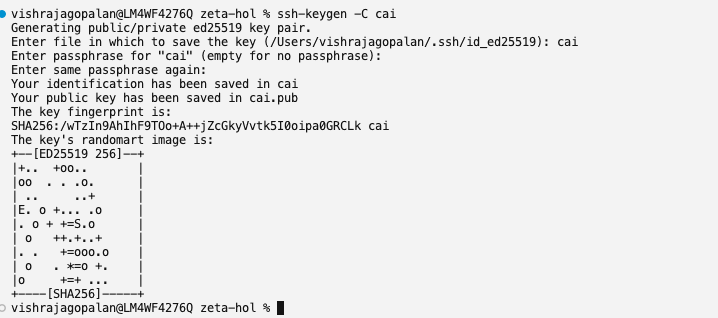
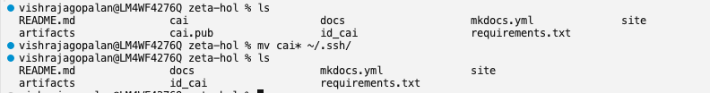
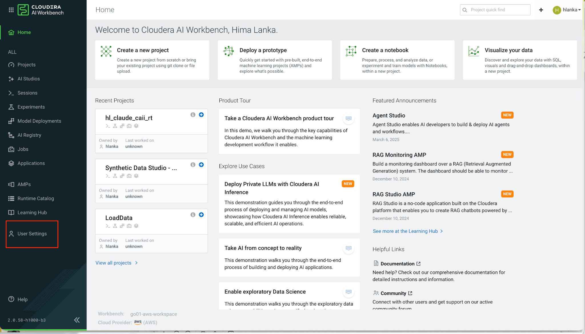
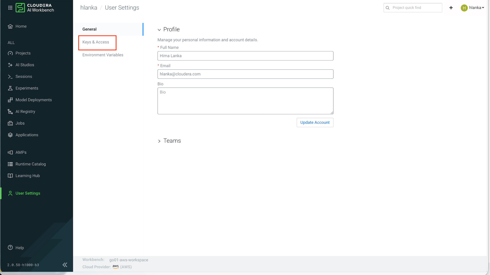
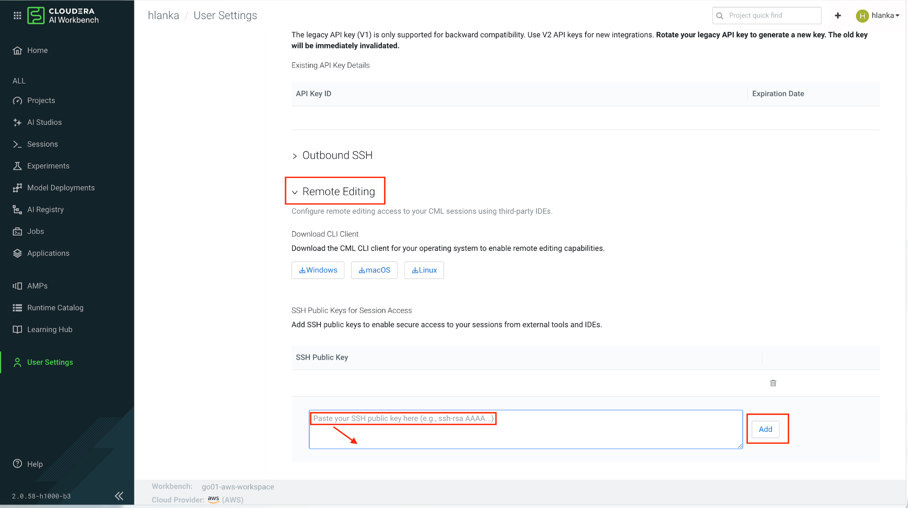
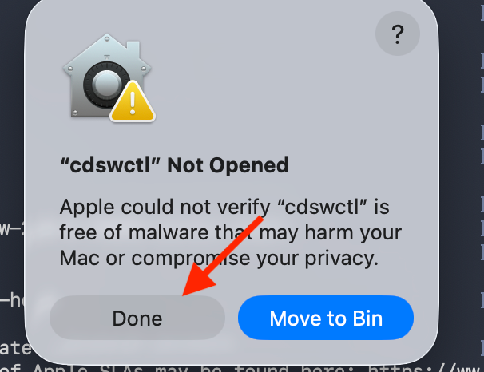
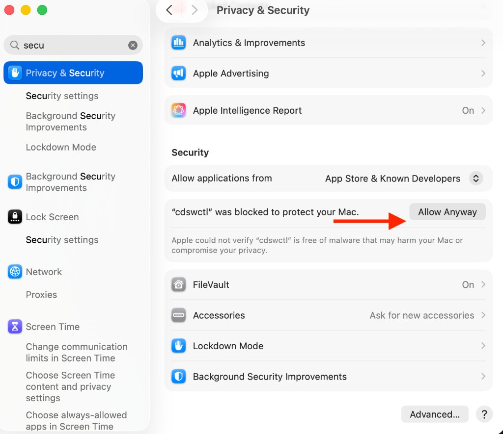
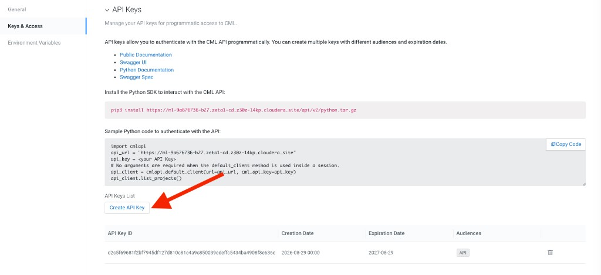
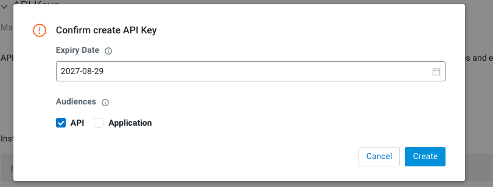
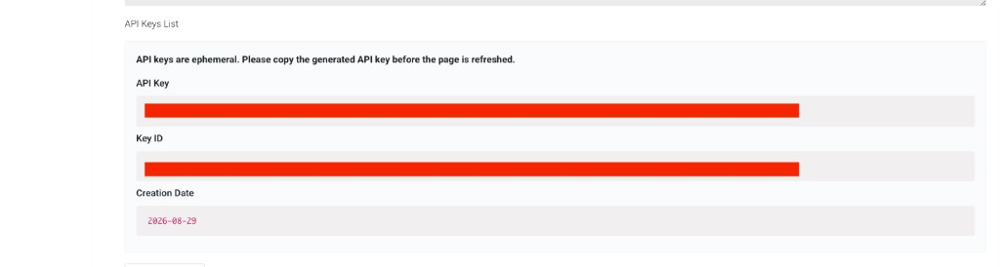

# Prerequisites

Complete these one-time steps before connecting Cursor to Cloudera AI. Content adapted from the [Cursor Remote SSH guide](https://superellipse.github.io/zeta-hol/vibe-coding/cursor-remote-ssh/).

Before you begin, ensure you have:

- [x] Logged in to Cloudera AI and completed workbench setup
- [x] Created your team project in the Cloudera AI Workbench
- [x] **Cursor IDE** installed on your local machine ([cursor.com](https://cursor.com))
- [x] **`jq`** installed (`brew install jq` on macOS) — required by the connection script

---

## 1. Generate an SSH Key

Run the following command to generate a new SSH key pair:

```bash
ssh-keygen -C cai
```

When prompted **"Enter file in which to save the key"**, type `cai` (this creates the key in your current directory rather than the default location).

Press **Enter** to skip the passphrase prompts (leave both empty). The connection script requires a key **without** a passphrase.



## 2. Move the Keys to `~/.ssh/`

If the `~/.ssh/` directory does not exist yet (common on a new machine), create it first:

```bash
mkdir -p ~/.ssh
chmod 700 ~/.ssh
```

Move the generated private and public key files into your SSH directory:

```bash
mv cai* ~/.ssh/
```

Verify the keys are in place:

```bash
ls ~/.ssh/cai*
```

You should see `~/.ssh/cai` (private key) and `~/.ssh/cai.pub` (public key).



## 3. Copy the Public Key

```bash
cat ~/.ssh/cai.pub
```

Copy the entire output line.

## 4. Add the Key to the Workbench

In the Cloudera AI Workbench, go to **User Settings → Keys & Access → Remote Editing**, paste your public key into **SSH Public Key**, and click **Add**.





While you are on the **Remote Editing** page, note that the **CML CLI client** (`cdswctl`) can be downloaded for your operating system — you will do this in the next step.



## 5. Download and Unblock the CML CLI Client

Download the **CML CLI client** (`cdswctl`) for your operating system from the **Remote Editing** section shown in step 4.

Unpack the downloaded archive. You should have a folder containing the `cdswctl` binary (for example, `cdsw-2.0.0.95880-darwin-amd64` on Mac).

### Mac: Allow cdswctl to Run

macOS quarantines downloaded files and will **not** let you run `cdswctl` directly from the terminal on first use. When you try, you may see a dialog like this — click **Done** (do not click Move to Bin):



Then allow the binary manually:

1. Open **System Settings → Privacy & Security → Security**
2. Scroll down until you see a message that **`"cdswctl" was blocked`** to protect your Mac
3. Click **Allow Anyway**



4. Run `cdswctl` once more from the terminal — macOS may ask you to confirm again; choose **Open**

!!! tip "Alternative: Remove Quarantine via Terminal"
    If the **Allow Anyway** button does not appear, you can remove the quarantine flag manually:

    ```bash
    xattr -d com.apple.quarantine /<PATH>/cdswctl
    ```

## 6. Add cdswctl to Your PATH

Add the folder containing `cdswctl` to your shell `PATH` so you can run it from any directory.

### Get the Path to cdswctl

In your terminal, change into the folder where you unpacked `cdswctl`, then print the full path:

```bash
cd /path/to/your/unpacked/cdsw-folder
pwd
```

Copy the output — you will use it in the steps below. The folder name will look something like `cdsw-2.0.0.95880-darwin-amd64`.

Verify `cdswctl` is in that folder:

```bash
ls cdswctl
```

### Mac (zsh)

**1. Create `~/.zshrc` if it does not exist**

```bash
touch ~/.zshrc
```

**2. Open the file to add your PATH**

Open it in TextEdit for easy editing:

```bash
open -e ~/.zshrc
```

Alternatively, edit in the terminal with `nano ~/.zshrc`.

**3. Add your PATH variable**

Paste the following line at the end of the file, replacing the path with the output from `pwd` above:

```bash
export PATH="/Users/<username>/path/to/cdsw-2.0.0.95880-darwin-amd64:$PATH"
```

Save the file (**Cmd+S**) and close it.

**4. Load the updated PATH**

```bash
source ~/.zshrc
```

**5. Verify**

```bash
cdswctl --help
```

You should see the `cdswctl` usage output without a "command not found" error.

!!! note "Mac Apple Silicon: bad CPU type in executable"
    If `cdswctl --help` returns:

    ```text
    zsh: bad CPU type in executable: cdswctl
    ```

    The downloaded binary is Intel-only and your Mac needs Rosetta. Install it (one-time):

    ```bash
    softwareupdate --install-rosetta
    ```

    Then rerun:

    ```bash
    cdswctl --help
    ```

    This step is only needed if you see the **bad CPU type** error above.

### Windows (PowerShell)

**1. Get the folder path**

In PowerShell, navigate to the unpacked folder and print the path:

```powershell
cd C:\Users\<username>\Downloads\cdsw-2.0.0.xxxxx-windows-amd64
(Get-Location).Path
```

Copy the output path.

**2. Add to your user PATH permanently**

Replace the path below with your copied path:

```powershell
[Environment]::SetEnvironmentVariable(
  "Path",
  $env:Path + ";C:\Users\<username>\Downloads\cdsw-2.0.0.xxxxx-windows-amd64",
  "User"
)
```

**3. Restart your terminal**, then verify:

```powershell
cdswctl --help
```

!!! note "Windows GUI Alternative"
    You can also add the folder via **Settings → System → About → Advanced system settings → Environment Variables**, then edit the **User** variable `Path` and add the folder containing `cdswctl.exe`.

## 7. Create an API Key

In the Cloudera AI Workbench, go to **User Settings → Keys & Access → API Keys** and click **Create API Key**.



In the confirmation dialog, accept the default expiry settings (ensure **API** is checked under Audiences) and click **Create**.



!!! warning "Save Your API Key Immediately"
    API keys are **ephemeral** — they are shown only once. Copy the generated API key and save it in a notepad or password manager. You will need this key in your `connect-cai.env` file.

    **Do not use a Legacy API key** — create a new API key in Cloudera AI if you see a 401 on login.



## 8. Create the SSH Config Entry

Add the following entry to `~/.ssh/config`:

```ssh-config
Host cai-workbench
    HostName localhost
    Port 3735
    User cdsw
    IdentityFile ~/.ssh/cai
    StrictHostKeyChecking no
    ServerAliveInterval 60
    ServerAliveCountMax 10
```

!!! note "Port is managed automatically"
    The `connect-cursor-cai.sh` script updates the `Port` value in this entry each session. You normally do not need to edit it manually.

---

Once all prerequisites are complete, proceed to **[Connecting Cursor to CAI](connecting-cursor.md)**.
